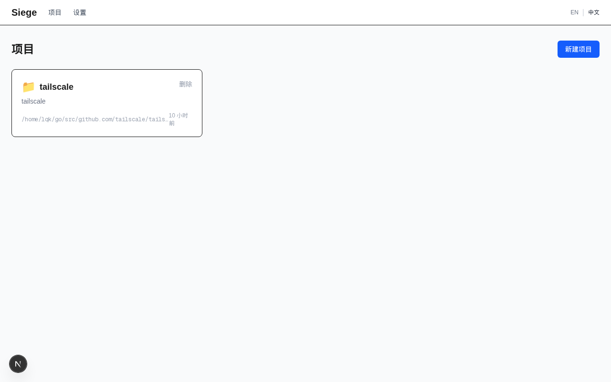
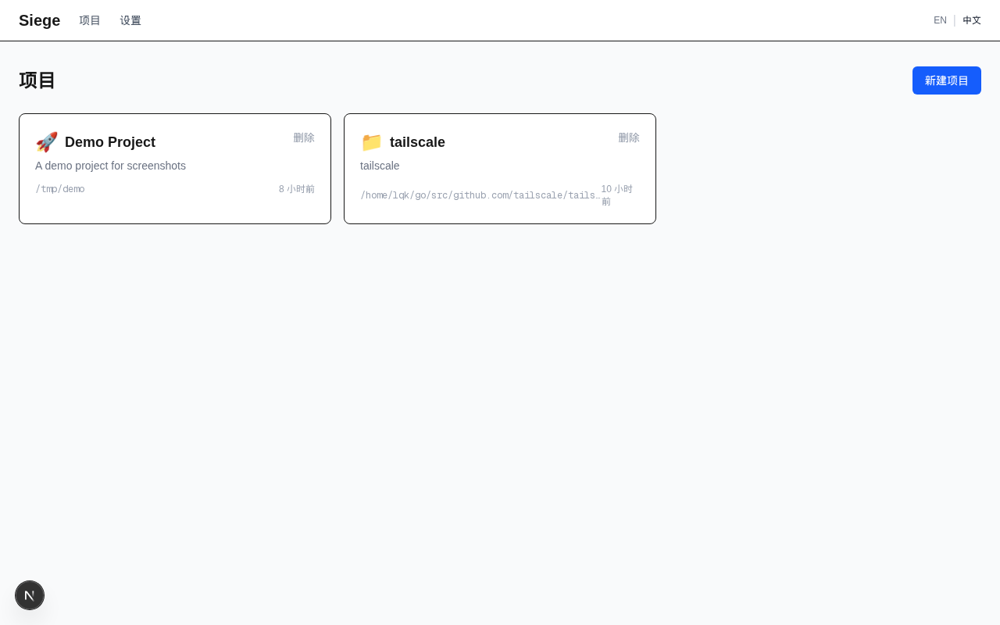
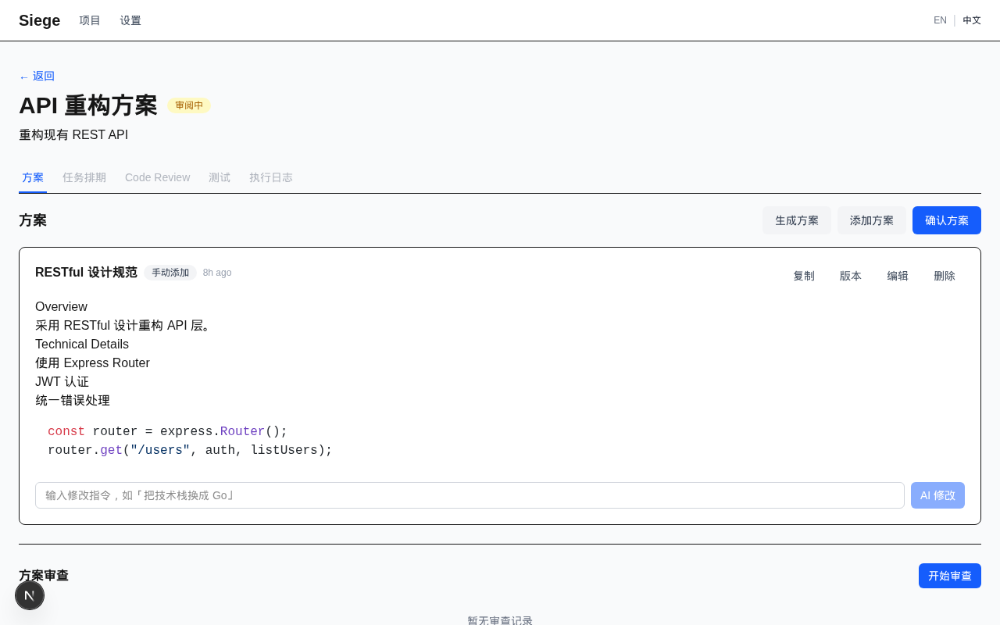
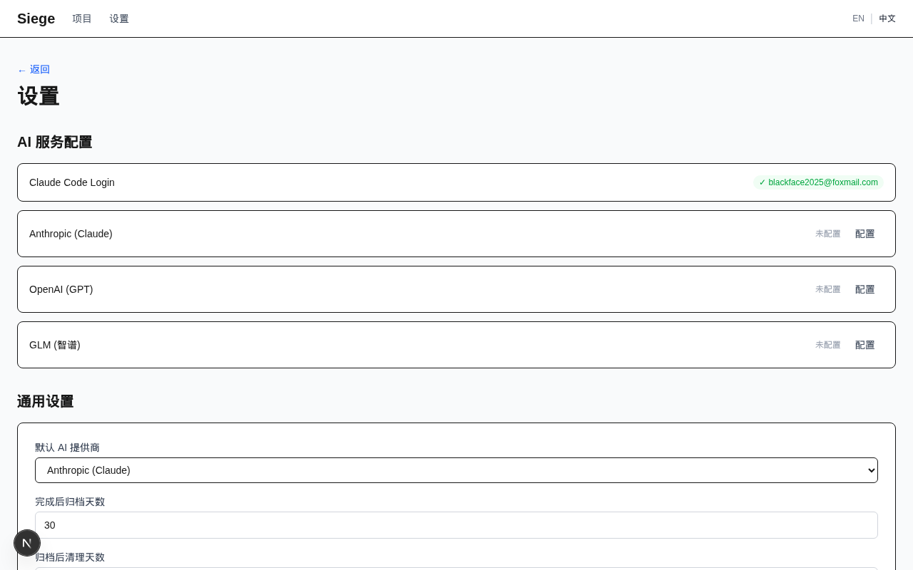

<p align="center">
  <h1 align="center">Siege</h1>
  <p align="center">
    AI-Powered Agent Development Tool
    <br />
    <em>From design to implementation, all in one place.</em>
  </p>
</p>

<p align="center">
  
  
  
  
  
</p>

---

Siege is a personal AI-powered tool that manages the full software development lifecycle: **plan** what to build, **generate** technical schemes with AI, **schedule** tasks, **execute** via Claude Code or Codex, **review** code quality, and **test** automatically.

## Screenshots

<table>
  <tr>
    <td><br /><em>Welcome & Onboarding</em></td>
    <td><br /><em>Project List</em></td>
  </tr>
  <tr>
    <td><br /><em>Scheme Detail with Markdown</em></td>
    <td><br /><em>AI Provider Settings</em></td>
  </tr>
</table>

## Core Workflow

```
Project  →  Plan  →  Scheme  →  Schedule  →  Execute  →  Review  →  Test
   │          │         │          │            │           │          │
 Create    Describe   AI Gen    Gantt       Claude      AI Code    AI Gen
 Repo      + Tags    + Edit    Chart      Code/Codex   Review    + Run
```

**1. Create Project** — Select a local repo or clone from GitHub. AI auto-detects `CLAUDE.md` for project context.

**2. Create Plan** — Describe what you want to build. AI generates a title. Organize in folders, tag as feature/bug/refactor.

**3. Generate Scheme** — AI searches the web and analyzes local code to produce technical proposals. Edit, review, or modify via chat.

**4. Generate Schedule** — AI breaks confirmed schemes into executable tasks with a Gantt chart timeline.

**5. Execute** — Run tasks via Claude Code or Codex CLI with real-time SSE progress streaming.

**6. Code Review** — AI reviews implementation for quality, security, and maintainability. One-click fix for findings.

**7. Test** — AI generates and runs test cases to verify the implementation.

## Features

### AI Integration
- **Multi-provider**: Anthropic (Claude), OpenAI (GPT), GLM (ZhiPu)
- **Proxy support**: Custom base URL for API relays
- **Claude Code login**: Works with your subscription, no API key needed
- **Session reuse**: Subsequent AI calls in the same plan resume the session (~10x faster)
- **Serial queue**: One AI task at a time, no process pile-up

### Project Management
- **Folder hierarchy** for organizing plans
- **Tags**: feature, bug, enhancement, refactor, docs, test, chore, perf
- **Recently opened** projects on homepage
- **Custom icons** per project
- **Relative timestamps** on all resources

### Scheme Management
- **AI generation** with provider and skill selection
- **Conversational modification** — chat to refine schemes
- **Version history** with line-by-line diff
- **Copy as Markdown**
- **Scheme review** with severity-tagged findings

### Execution
- **Claude Code** and **Codex CLI** as execution engines
- **Skills integration** from `~/.claude/skills/`
- **SSE real-time progress** streaming
- **Gantt chart** schedule visualization

### Data Management
- **Auto-archive** completed plans after configurable days
- **Backup** to Local filesystem, Obsidian vault, or Notion
- **Import** plans from Markdown files
- **SQLite** — zero-ops, single file database

### i18n
- Full Chinese and English support
- All UI labels, status badges, and messages translated

## Quick Start

```bash
# Clone
git clone https://github.com/Kotodian/siege.git
cd siege

# Install
npm install

# Start
npm run dev
```

Open [http://localhost:3000](http://localhost:3000) — the onboarding guide will walk you through GitHub connection, AI configuration, and creating your first project.

### Prerequisites

- **Node.js** 20+
- **Claude Code** (`claude` CLI) — for AI features without API key
- **GitHub CLI** (`gh`) — optional, for GitHub repo integration

### AI Configuration

Siege supports three modes for AI access:

| Mode | Speed | Setup |
|------|-------|-------|
| **API Key** | Fast (streaming) | Get key from provider console |
| **Proxy/Relay** | Fast | Custom base URL + key |
| **Claude Login** | ~1-2 min/call | Just `claude login`, no key needed |

Configure in **Settings** or during onboarding.

## Tech Stack

| Layer | Technology |
|-------|-----------|
| Framework | Next.js 15 (App Router) |
| Language | TypeScript |
| Database | SQLite (Drizzle ORM + better-sqlite3) |
| Styling | Tailwind CSS |
| AI SDK | Vercel AI SDK + Claude/Codex CLI fallback |
| i18n | next-intl |
| Markdown | react-markdown + rehype-highlight |
| Charts | frappe-gantt |
| Testing | Vitest (61 tests) |

## Project Structure

```
src/
├── app/
│   ├── [locale]/          # i18n pages
│   │   ├── page.tsx       # Project list / Onboarding
│   │   ├── projects/      # Project detail, Plan detail
│   │   └── settings/      # AI config, Skills, Archive
│   └── api/               # REST API routes
│       ├── projects/      # CRUD + analyze
│       ├── plans/         # CRUD + confirm + suggest-title
│       ├── schemes/       # CRUD + generate + chat + versions
│       ├── schedules/     # CRUD + generate
│       ├── reviews/       # CRUD + generate
│       ├── test-suites/   # CRUD + generate + run
│       └── ...
├── lib/
│   ├── ai/                # Provider, generators, CLI fallback, session, queue
│   ├── db/                # Drizzle schema + migrations
│   ├── backup/            # Local, Obsidian, Notion backends
│   └── ...
├── components/
│   ├── scheme/            # Scheme cards, editor, versions, generate dialog
│   ├── review/            # Review panel with AI fix
│   ├── schedule/          # Schedule view + Gantt
│   ├── gantt/             # Gantt chart wrapper
│   ├── onboarding/        # First-time setup guide
│   └── ui/                # Button, Dialog, Input, Tabs, StatusBadge, ...
└── messages/              # en.json, zh.json
```

## Development

```bash
# Run tests
npm test

# Watch mode
npm run test:watch

# Build
npm run build

# Generate DB migration after schema change
npx drizzle-kit generate
```

## License

MIT
