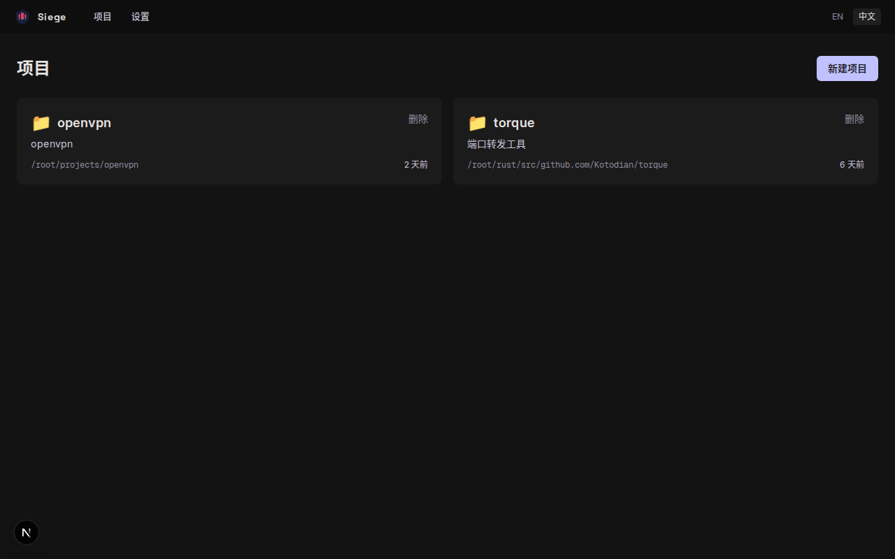
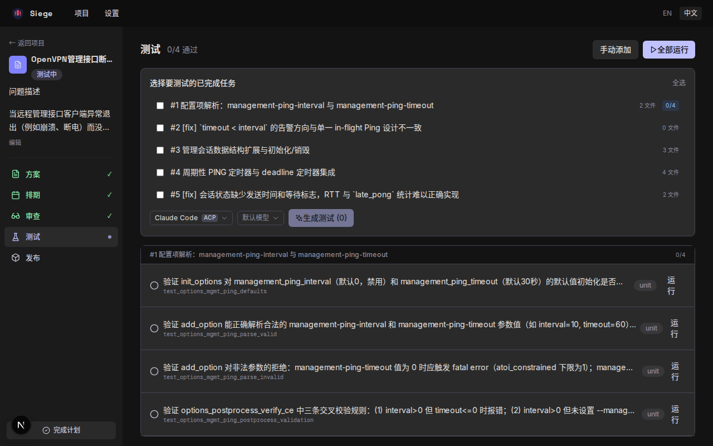
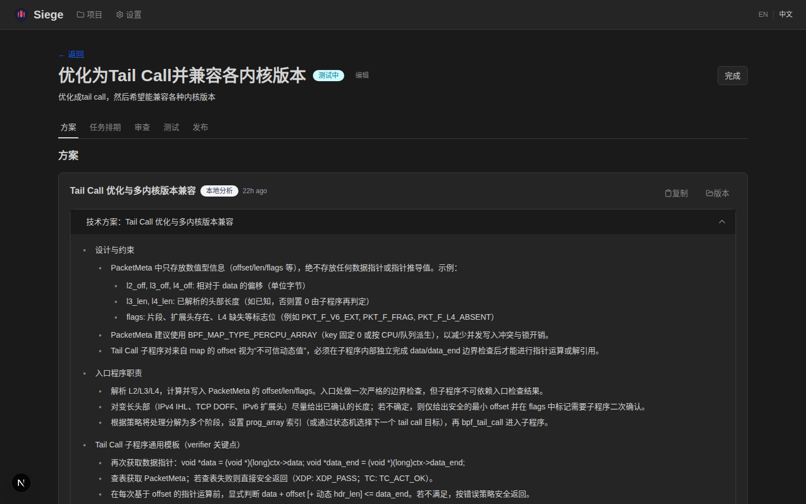
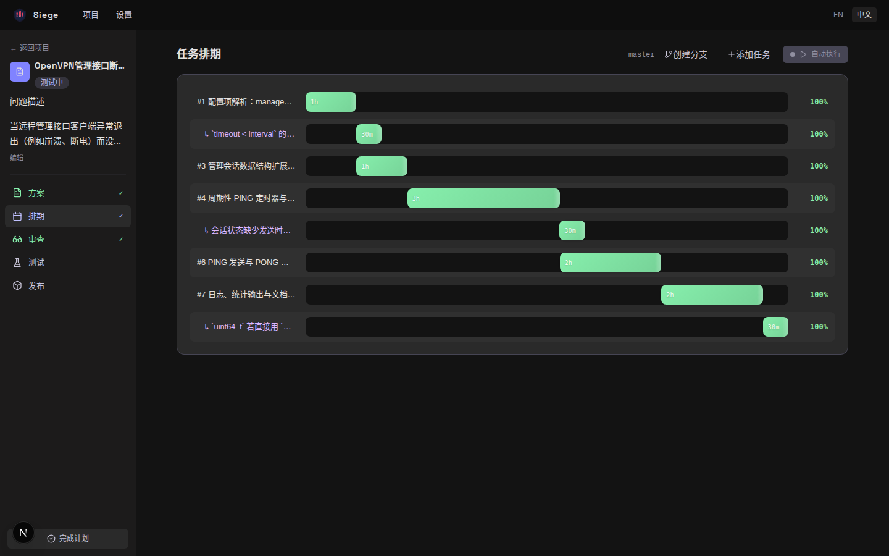

<p align="center">
  <h1 align="center">Siege</h1>
  <p align="center">
    AI-Powered Agent Development Tool
    <br />
    <a href="README_CN.md">中文文档</a>
    <br />
    <em>From design to implementation, all in one place.</em>
  </p>
</p>

<p align="center">
  
  
  
  
  
</p>

---

## Why Siege?

Siege wraps Claude Code / Codex into a **full development lifecycle manager** with a visual UI:

```
 Plan  →  Scheme  →  Schedule  →  Execute  →  Review  →  Test
  │         │          │            │           │          │
Describe   AI Gen    Gantt       Claude      Diff View   AI Gen
+ Tags    + Edit    Timeline   Code/Codex   + Findings  + Run
```

- **Persistent context** — Projects, plans, schemes, and execution logs are all stored in SQLite. Pick up where you left off.
- **Structured design** — AI generates technical schemes before writing any code. Review and refine via chat.
- **Visual task scheduling** — AI breaks work into ordered tasks displayed on a Gantt chart.
- **GitHub PR-style code review** — `git diff` with syntax highlighting, file tree, inline AI findings, one-click fix.
- **AI-powered testing** — Auto-generate and run test cases based on actual code changes.
- **Multi-provider AI** — Anthropic (Claude), OpenAI (GPT), GLM (ZhiPu). Works with API keys, proxy relays, or Claude subscription login.

---

## Screenshots

<table>
  <tr>
    <td><br /><em>Project List — Monolith Dark Theme</em></td>
    <td><br /><em>Plan Detail — Sidebar Workflow Navigation</em></td>
  </tr>
  <tr>
    <td><br /><em>AI-Generated Technical Scheme</em></td>
    <td><br /><em>Gantt Chart + Auto-Execute Timeline</em></td>
  </tr>
  <tr>
    <td><br /><em>Code Review — Diff Viewer + Findings</em></td>
    <td><br /><em>AI Provider Configuration</em></td>
  </tr>
</table>

## Core Workflow

**1. Create Project** — Select a local repo. AI auto-detects `CLAUDE.md` for project context.

**2. Create Plan** — Describe what you want to build. Organize in folders, tag as feature/bug/refactor.

**3. Generate Scheme** — AI analyzes code and produces technical proposals. Edit, review, or refine via chat.

**4. Generate Schedule** — AI breaks confirmed schemes into executable tasks with a Gantt chart timeline.

**5. Execute** — Auto-execute runs tasks sequentially. Each task uses focused prompts with context from previous tasks.

**6. Code Review** — View `git diff` with syntax highlighting, file tree navigation, and inline AI findings.

**7. Test** — Select completed tasks, AI generates test cases from actual code changes.

## Features

### AI Integration
- **Multi-provider**: Anthropic (Claude), OpenAI (GPT), GLM (ZhiPu)
- **Model selection**: Dropdown model picker on every AI action
- **Proxy support**: Custom base URL for API relays
- **Claude Code / Codex ACP**: Agent Client Protocol, no API key needed
- **Session reuse**: Subsequent AI calls resume the session for context continuity

### Execution
- **Auto-execute**: One click to run all tasks sequentially
- **Skills injection**: Select from custom + plugin skills per task
- **File snapshot capture**: Per-task incremental diffs for accurate code review

### Code Review
- **Git diff viewer** with syntax highlighting
- **Task filter**: View diffs from a specific task
- **File tree sidebar** grouped by task with +/- stats
- **Findings grouped by task**: Collapsible panels with unresolved count
- **"Fix All" button**: Bulk AI fix for all unresolved findings
- **One-click "AI Fix"** — apply suggestions directly to files

### Testing
- **Task-based generation**: AI generates tests from actual code changes
- **Tests grouped by task**: Visual pass/fail per task group
- **Run all with progress**: Shows execution status per test

### Multi-Source Import
- **Markdown** — import plans from `.md` files
- **Notion** — search pages/databases, import with blocks-to-markdown
- **Jira** — search Epics/Stories via JQL
- **Confluence** — search pages via CQL
- **Feishu** — search wiki docs with block-level conversion
- **GitHub Issues / GitLab Issues** — search and import issues
- **MCP Server** — connect any MCP server, import resources as plans

### Design System
- **Monolith** — deep obsidian dark theme with tonal surface layering
- **No-border rule** — boundaries defined through background color shifts, not lines
- **Space Grotesk + Inter** typography for editorial precision
- **Sidebar workflow navigation** on plan detail pages

## Quick Start

```bash
git clone https://github.com/Kotodian/siege.git
cd siege
npm install
npm run dev
```

Open [http://localhost:3000](http://localhost:3000) — the onboarding guide walks you through setup.

### Prerequisites

- **Node.js** 20+
- **Claude Code** (`claude` CLI) — for ACP engine (recommended)
- **GitHub CLI** (`gh`) — optional, for PR integration

## Deploy

### Direct

```bash
npm run build
PORT=3000 npm start
```

### Docker

```bash
docker build -t siege .
docker run -d -p 3000:3000 -v siege-data:/app/data siege
```

### Data

- Database: `./data/siege.db` (SQLite, auto-created)
- Set `DATA_DIR` environment variable to change the data directory

## Tech Stack

| Layer | Technology |
|-------|-----------|
| Framework | Next.js 16 (App Router) |
| Language | TypeScript |
| Database | SQLite (Drizzle ORM + better-sqlite3) |
| Styling | Tailwind CSS 4 |
| Design | Monolith dark theme |
| AI SDK | Vercel AI SDK + Claude/Codex CLI fallback |
| i18n | next-intl |
| Charts | frappe-gantt |
| Testing | Vitest |

## Development

```bash
npm test              # Run all tests
npm run test:watch    # Watch mode
npm run build         # Production build
npx drizzle-kit generate  # DB migration after schema change
```

## License

MIT
